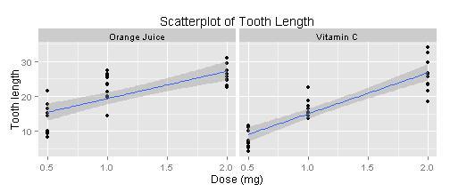
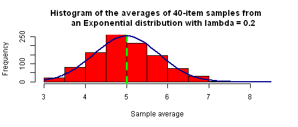

## Overview

In this project you will investigate the exponential distribution in R and compare it with the Central Limit Theorem. The exponential distribution can be simulated in R with rexp(n, lambda) where $\lambda$ is the rate parameter. The mean of exponential distribution is $1/\lambda$ and the standard deviation is also $1/\lambda$. Set $\lambda= 0.2$ for all of the simulations. You will investigate the distribution of averages of 40 exponentials. Note that you will need to do a thousand simulations.

Illustrate via simulation and associated explanatory text the properties of the distribution of the mean of 40 exponentials.  You should  
1. Show the sample mean and compare it to the theoretical mean of the distribution.  
2. Show how variable the sample is (via variance) and compare it to the theoretical variance of the distribution.  
3. Show that the distribution is approximately normal.  

## Simulations

First, I generate the data set for the project. I generate a matrix of 1000 samples of 40 exponentials each. Each sample appears as a column in the matrix *data*.


```r
set.seed(100)
data <- replicate(1000, rexp(40, 0.2), simplify = "array")
```

**Task 1:** Show the sample mean and compare it to the theoretical mean of the distribution.  
**Solution:**
I plot a histogram of the means of the 1000 samples. The theory predicts the sample mean is be normally distributed with mean of 1/0.2=5 and standard deviation of $\frac{1/0.2}{\sqrt{40}}=0.791$ .


```r
averages <- apply(data, 2, mean)
par(mar = rep(4,4))
hist(averages,
     main = "Histogram of the averages of 40-item samples from 
     an Exponential distribution with lambda = 0.2",
     xlab = "Sample average", ylab = "Frequency", col = "red")
abline(v = 5, col = "green", lwd = 3, lty = 2)
```

 

```r
print(paste("Mean of sample averages is:",mean(averages)))
```

```
## [1] "Mean of sample averages is: 4.9997019268744"
```

I see that indeed the sample mean is distributed about the theoretical value of 5 (mean of sample averages is 4.9997), shown by a green dashed line, with a standard deviation of 0.791.

**Task 2:** Show how variable the sample is (via variance) and compare it to the theoretical variance of the distribution.  
**Solution:**
I plot a histogram of the variances of the 1000 samples. The theory predicts the expected values of the variance to be will be $(1/0.2)^2=25$.


```r
variances <- apply(data, 2, var)
hist(variances,
     main = "Histogram of the variances of 40-item samples from
     an Exponential distribution with lambda =0.2",
     xlab = "Sample variance", ylab = "Frequency",
     col = "blue")
abline(v = 25, col = "green", lwd = 3, lty = 2)
```

 

I see that indeed the sample variance takes the theoretical value of 25, shown by the green dashed line, on average.

**Question:** Explain in your own words the differences of the variances. **Answer:** The sample variances are different, since the sample size is finite. Thus the sample variances give the population variance only on average, and the sample variances are distributed with a finite standard deviation.

**Task 3:** Show that the distribution is approximately normal.  
**Solution:**
Theory predicts the sample means to be approximately normally-distributed, since the sample size *n* is greater than 30. First, I demonstrate the normality of the distribution by superimposing a normal bell curve on it with the theoretical mean and standard deviation.


```r
hist(averages, 
     main = "Histogram of the averages of 40-item samples from 
     an Exponential distribution with lambda = 0.2",
     xlab = "Sample average", ylab = "Frequency", col = "red",
     ylim = c(0,250))
abline(v = 5, col = "green", lwd = 3, lty = 2)
curve(500*dnorm(x, 5, (1/0.2)/sqrt(40)), col = "darkblue", lwd = 2, add = T)
```

 

The histogram does seem to follow the normal curve. There is a good fit. Second, I employ a more quantitative approach. I use the Kolmogorov-Smirnov test to see if the histogram could have come from a non-Gaussian distribution. The null hypothesis is that the histogram came from a normal distribution.

```r
ks.test(averages, "pnorm", mean = 5, sd = (1/0.2)/sqrt(40))
```

```
## 
## 	One-sample Kolmogorov-Smirnov test
## 
## data:  averages
## D = 0.0419, p-value = 0.05959
## alternative hypothesis: two-sided
```
The obtained p-value is 0.05959 > 0.05, so I fail to reject the null hypothesis and conclude, with 95% confidence, that the curve is normal.
