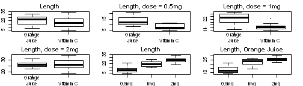

##Code and Plots for Task 1
###Boxplots

```r
library(datasets)
data(ToothGrowth)
par(mfrow = c(2,3), mar = c(2,2,2,2))
boxplot(subset(ToothGrowth, supp == "OJ")$len,
        subset(ToothGrowth, supp == "VC")$len,
        names = c("Orange\nJuice", "Vitamin C"), main = "Length")
boxplot(subset(ToothGrowth, supp == "OJ" & dose == 0.5)$len,
       subset(ToothGrowth, supp == "VC" & dose == 0.5)$len,
       names = c("Orange\nJuice", "Vitamin C"), main = "Length, dose = 0.5mg")
boxplot(subset(ToothGrowth, supp == "OJ" & dose == 1)$len,
        subset(ToothGrowth, supp == "VC" & dose == 1)$len,
        names = c("Orange\nJuice", "Vitamin C"), main = "Length, dose = 1mg")
boxplot(subset(ToothGrowth, supp == "OJ" & dose == 2)$len,
        subset(ToothGrowth, supp == "VC" & dose == 2)$len,
        names = c("Orange\nJuice", "Vitamin C"), main = "Length, dose = 2mg")
boxplot(subset(ToothGrowth, dose == 0.5)$len,
        subset(ToothGrowth, dose == 1.0)$len,
        subset(ToothGrowth, dose == 2.0)$len,
        names = c("0.5mg","1mg","2mg"), main = "Length")
boxplot(subset(ToothGrowth, dose == 0.5 & supp == "OJ")$len,
        subset(ToothGrowth, dose == 1.0 & supp == "OJ")$len,
        subset(ToothGrowth, dose == 2.0 & supp == "OJ")$len,
        names = c("0.5mg","1mg","2mg"), main = "Length, Orange Juice")
```

 

```r
par(mfrow=c(1,3), mar = c(2,2,2,2))
boxplot(subset(ToothGrowth, dose == 0.5 & supp == "VC")$len,
        subset(ToothGrowth, dose == 1.0 & supp == "VC")$len,
        subset(ToothGrowth, dose == 2.0 & supp == "VC")$len,
        names = c("0.5mg","1mg", "2mg"), main = "Length, Vitamin C")
```

 

###Regression lines

```r
levels(ToothGrowth$supp) <- c("Orange Juice", "Vitamin C")
library(ggplot2)
qplot(dose, len, data = ToothGrowth) + facet_grid(. ~ supp) +
    geom_point() + geom_smooth(method = "lm") + labs(x = "Dose (mg)") +
    labs(y = "Tooth length") +
    labs(title = "Scatterplot of Tooth Length")
```

 

```r
levels(ToothGrowth$supp) <- c("OJ", "VC")
```
## Code and code output for task 4

```r
t.test(subset(ToothGrowth, supp == "OJ")$len, subset(ToothGrowth, supp == "VC")$len,
       "two.sided")$conf[1:2] # Hypothesis 1
```

```
## [1] -0.1710156  7.5710156
```

```r
t.test(subset(ToothGrowth, supp == "OJ" & dose == 0.5)$len,
       subset(ToothGrowth, supp == "VC" & dose == 0.5)$len, "greater")$conf[1:2] # H2
```

```
## [1] 2.34604     Inf
```

```r
t.test(subset(ToothGrowth, supp == "OJ" & dose == 1)$len,
       subset(ToothGrowth, supp == "VC" & dose == 1)$len, "greater")$conf[1:2] # H3
```

```
## [1] 3.356158      Inf
```

```r
t.test(subset(ToothGrowth, supp == "OJ" & dose == 2)$len,
       subset(ToothGrowth, supp == "VC" & dose == 2)$len, "greater")$conf[1:2] # H4
```

```
## [1] -3.1335     Inf
```

```r
t.test(subset(ToothGrowth, dose == 0.5)$len,
       subset(ToothGrowth, dose == 1)$len, "less")$conf[1:2] # H5
```

```
## [1]      -Inf -6.753323
```

```r
t.test(subset(ToothGrowth, dose == 1)$len,
       subset(ToothGrowth, dose == 2)$len, "less")$conf[1:2] # H6
```

```
## [1]     -Inf -4.17387
```

```r
t.test(subset(ToothGrowth, dose == 0.5 & supp == "OJ")$len,
       subset(ToothGrowth, dose == 1 & supp == "OJ")$len, "less")$conf[1:2] # H7 
```

```
## [1]      -Inf -6.214316
```

```r
t.test(subset(ToothGrowth, dose == 0.5 & supp == "VC")$len,
       subset(ToothGrowth, dose == 1 & supp == "VC")$len, "less")$conf[1:2] # H8
```

```
## [1]      -Inf -6.746867
```

```r
t.test(subset(ToothGrowth, dose == 1 & supp == "OJ")$len,
       subset(ToothGrowth, dose == 2 & supp == "OJ")$len, "less")$conf[1:2] # H9
```

```
## [1]       -Inf -0.7486236
```

```r
t.test(subset(ToothGrowth, dose == 1 & supp == "VC")$len,
       subset(ToothGrowth, dose == 2 & supp == "VC")$len, "less")$conf[1:2] # H10
```

```
## [1]      -Inf -6.346525
```
